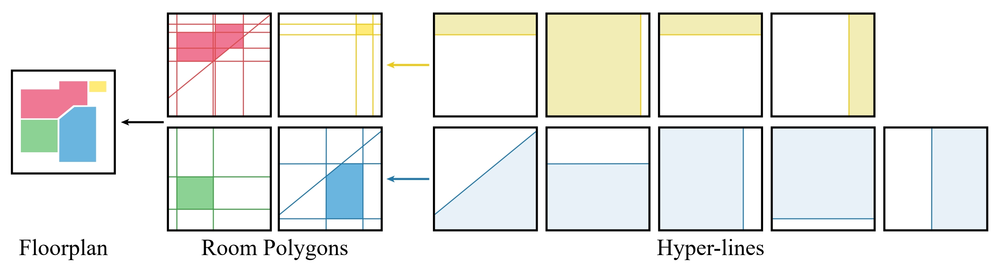

<div align="center">
<h2 align="center" style="font-size: 35px;">FRI-Net: Floorplan Reconstruction via Room-wise Implicit Representation</h2>
<h3 align="center" style="font-size: 20px;">ECCV 2024</h3>

<a href="https://github.com/Daisy-1227">Honghao Xu</a>, <a 
href="https://github.com/Juzhan">Juzhan Xu</a>, <a 
href="https://github.com/zzilch">Zeyu Huang</a>, <a 
href="https://pengfeixu.com/">Pengfei Xu</a>, <a href="https://vcc.tech/~huihuang">Hui Huang</a>, <a href="https://csse.szu.edu.cn/staff/ruizhenhu/">Ruizhen Hu</a>



</div>

This repository provides code, data and pretrained models for **FRI-Net**.

[[Paper](https://arxiv.org/pdf/2407.10687)]   

## News
* We have updated the model code.
* We have updated the evaluation and the training codes.

## Preparation

### Environment setup
Since our code is built upon [Roomformer](https://github.com/ywyue/RoomFormer), we follow the environment setup from Roomformer.
```bash
# Create conda environment
conda create -n frinet python=3.8
conda activate frinet

# install pytorch and other requried packages
pip install torch==1.9.0+cu111 torchvision==0.10.0+cu111 -f https://download.pytorch.org/whl/torch_stable.html
pip install -r requirements.txt

# Compile the defromable-attention models from deformable-DETR
cd models/ops
sh make.sh
```
### Data preparation

We directly provide the processed data and pretrained checkpoints, please download [them](https://drive.google.com/file/d/1TgqNB59ZOqdTSJieNoeHR1XvwEfsuIzB/view) and organize them as following:

```
FRI-Net/
└── data/
    └── stru3d/
        ├── annotations/
        ├── input/
        ├── occ/
        ├── ...
└── checkpoints/
    ├── pretrained_ckpt.pth
    ├── pretrained_room_wise_encoder.pth
```

For details on data preprocessing, please refer to [datasets](datasets).

## Evaluation
Please run the following command to evaluate the model on Structured3D test set:
```shell
python eval_stru3d.py --checkpoint ./checkpoints/pretrained_ckpt.pth
```
You can get the visualized results on the [results](results).

## Training
To train FRI-Net on Structured 3D, please run the following command: 
```shell
python train_stru3d.py --phase=0 --job_name=train_stru3d
python train_stru3d.py --phase=1 --job_name=train_stru3d
python train_stru3d.py --phase=2 --job_name=train_stru3d
```

## Citation
If you have any question about this repo, feel free to drop me an email littledaisy20001227@gmail.com

If you find FRI-Net useful in your research, please cite our paper:
```BibTex
@inproceedings{xu2024fri,
    title={FRI-Net: Floorplan Reconstruction via Room-wise Implicit Representation},
    author={Honghao Xu and Juzhan Xu and Zeyu Huang and Pengfei Xu and Hui Huang and Ruizhen Hu},
    booktitle={ECCV}
    year={2024}
}
```

## Acknowledgment

We thank for the following open source projects:

* [RoomFormer](https://github.com/ywyue/RoomFormer)
* [BSP-Net](https://github.com/czq142857/BSP-NET-pytorch)
* [DETR](https://github.com/facebookresearch/detr)
* [Deformable-DETR](https://github.com/fundamentalvision/Deformable-DETR)
* [Structured3D](https://github.com/bertjiazheng/Structured3D)